<h1 align="center">Hi 👋, Aku Akbar Iqbnu Prayoga</h1>
<h3 align="center">Front-End Developer | Data Enthusiast | Web Developer | Machine Learning</h3>

<div align="center">
  
</div>

<p align="center">
  <a href="https://nexct.vercel.app/">
    
  </a>
  <a href="https://github.com/AkbarIqbnuPrayoga">
    
  </a>
  <a href="https://www.instagram.com/akbariqbnu/">
    
  </a>
  <a href="https://www.tiktok.com/@4kb444r?">
    
  </a>
</p>

---

### 🐍 About Me

<td width="35%" align="center">

</td>

Saya memiliki minat yang kuat di bidang **Front-End Development**, **Data Analyst**, dan **Machine Learning**. Saya berpengalaman dalam mengembangkan antarmuka pengguna yang interaktif dan responsif, menganalisis data untuk menghasilkan wawasan yang berguna, serta mengeksplorasi penerapan model machine learning untuk solusi berbasis database. Komitmen saya dalam mengembangkan skill di bidang IT dan open-source. Saya percaya teknologi bukan sekadar alat, tapi solusi untuk menciptakan dampak nyata.

- 🌱 Saat ini sedang belajar: **Machine Learning & Web Developer**
- 👯 Siap berkolaborasi di: **Proyek Web Development & Data Analyst**
- 📫 Hubungi saya: **akbariqbnup@gmail.com**
- ⚡ Fun fact: Saya suka ngoding sambil makan pilus

<br clear="right"/>

---

## 📈 Coding Streak

<div align="center">


</div>

---

### 🐍 Contribution Project

<div align="center">
  
</div>

---

### 🚀 Projects

<table>
<tr>
    <td width="50%">
      <h3 align="center">NEXCT-Image2Prompt</h3>
      <div align="center">
        <a href="https://nexct-image2prompt.vercel.app" target="_blank">
          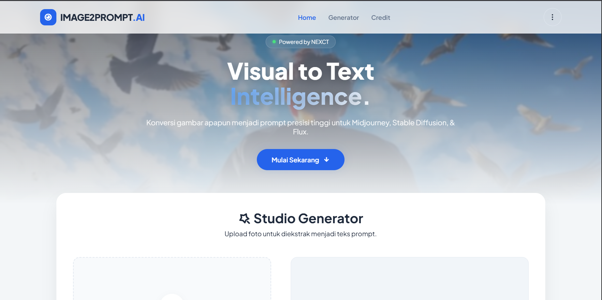
        </a>
        <p>
          <strong>NEXCT-Image2Prompt</strong> - Sebuah website untuk membuat gambar menjadi sebuah teks prompt untuk digunakan kembali.
        </p>
        <p>
          <a href="https://nexct-image2prompt.vercel.app">
            
          </a>
        </p>
      </div>
    </td>
    <td width="50%">
      <h3 align="center">NEXCT-Music Hub</h3>
      <div align="center">
        <a href="https://nexct-music.vercel.app" target="_blank">
          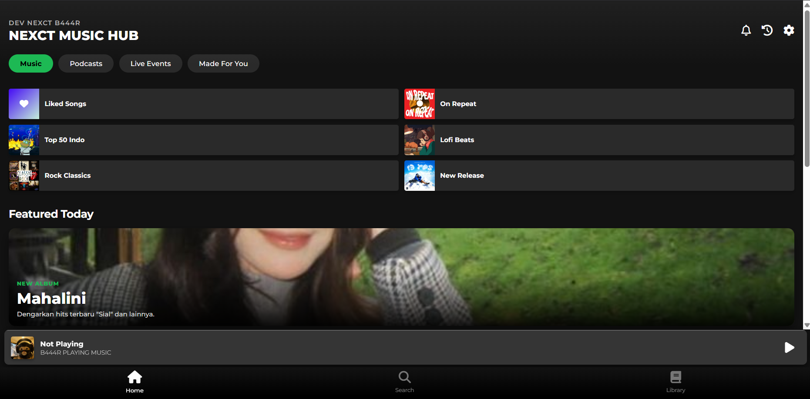
        </a>
        <p>
          <strong>NEXCT-Music Hub</strong> - Sebuah website untuk mendengarkan lagu dengan menggunakan interface yang mirip dengan spotify.
        </p>
        <p>
          <a href="https://nexct-music.vercel.app">
            
          </a>
        </p>
      </div>
    </td>
</tr>
<tr>
    <td width="50%">
      <h3 align="center">NEXCT-ShortLink</h3>
      <div align="center">
        <a href="https://nexct-shortlink.vercel.app" target="_blank">
          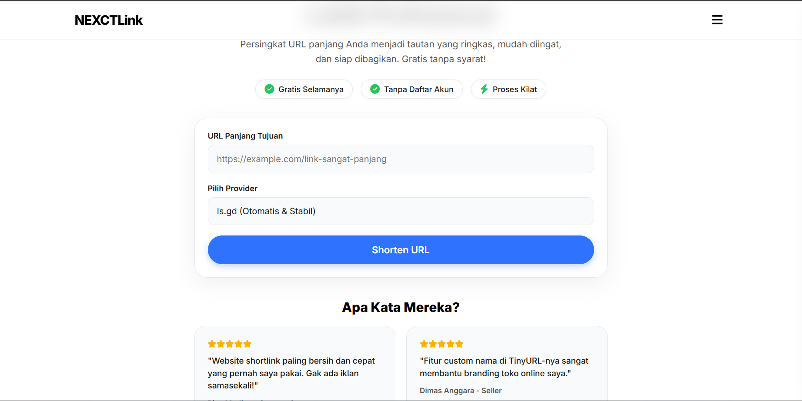
        </a>
        <p>
          <strong>NEXCT-ShortLink</strong> - Sebuah website yang digunakan untuk mengubah link panjang menjadi link yang pendek untuk dibagikan.
        </p>
        <p>
          <a href="https://nexct-shortlink.vercel.app">
            
          </a>
        </p>
      </div>
    </td>
    <td width="50%">
      <h3 align="center">NEXCT-SpotifyDL</h3>
      <div align="center">
        <a href="https://nexct-spotifydl.vercel.app/" target="_blank">
          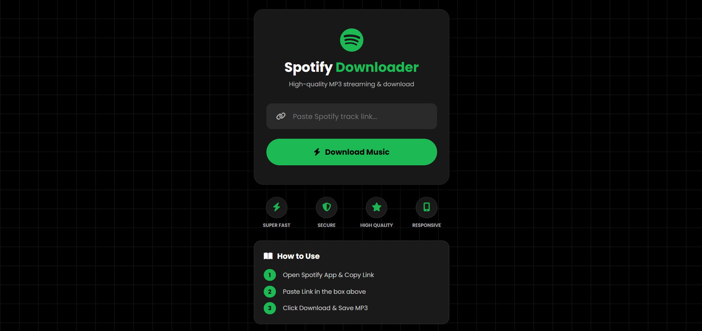
        </a>
        <p>
          <strong>NEXCT-SpotifyDL</strong> - Sebuah Web downloader sederhana untuk mengunduh lagu Spotify dengan tampilan modern dan mudah digunakan.
        </p>
        <p>
          <a href="https://nexct-spotifydl.vercel.app/">
            
          </a>
        </p>
      </div>
    </td>
</tr>
<tr>
    <td width="50%">
      <h3 align="center">NEXCT-DramaBox</h3>
      <div align="center">
        <a href="https://nexct-dramabox.vercel.app" target="_blank">
          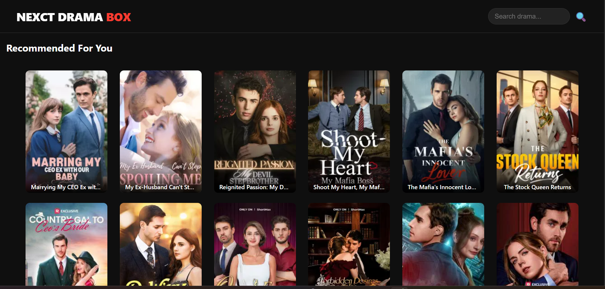
        </a>
        <p>
          <strong>NEXCT-DramaBox</strong> - Sebuah Web streaming drama sederhana untuk menonton berbagai video drama secara online dengan tampilan modern dan responsif.
        </p>
        <p>
          <a href="https://nexct-dramabox.vercel.app/">
            
          </a>
        </p>
      </div>
    </td>
    <td width="50%">
      <h3 align="center">NEXCT-TiktokDL</h3>
      <div align="center">
        <a href="https://nexct-tiktokdl.vercel.app/" target="_blank">
          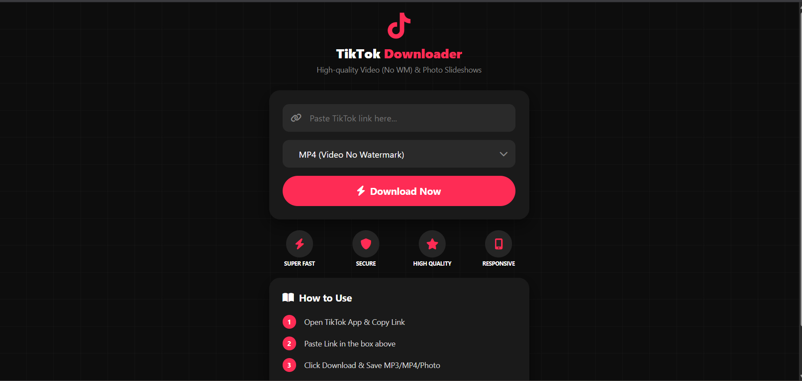
        </a>
        <p>
          <strong>NEXCT-TiktokDL</strong> - Sebuah Web downloader sederhana untuk mengunduh audio, video, dan foto dari link TikTok.
        </p>
        <p>
          <a href="https://nexct-tiktokdl.vercel.app/">
            
          </a>
        </p>
      </div>
    </td>
</tr>
<tr>
    <td width="50%">
      <h3 align="center">NEXCT-Nime</h3>
      <div align="center">
        <a href="https://nexctnime.vercel.app/" target="_blank">
          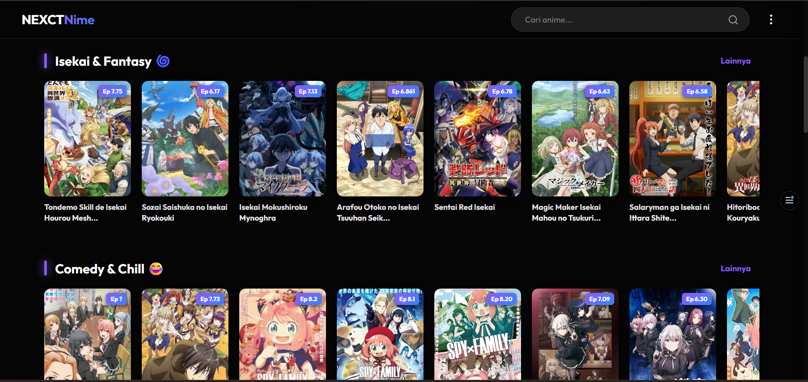
        </a>
        <p>
          <strong>NEXCT-Nime</strong> - Sebuah Web streaming anime dengan pilihan berbagai resolusi dan server untuk pengalaman menonton yang fleksibel dan responsif.
        </p>
        <p>
          <a href="https://nexctnime.vercel.app/">
            
          </a>
        </p>
      </div>
    </td>
    <td width="50%">
      <h3 align="center">NEXCT-Lyrics</h3>
      <div align="center">
        <a href="https://nexct-lyrics.vercel.app/" target="_blank">
          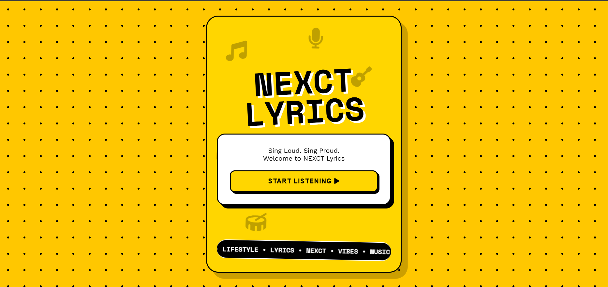
        </a>
        <p>
          <strong>NEXCT-Lyrics</strong> - Web aplikasi pencari dan penampil lirik lagu, dengan tampilan sederhana dan mudah digunakan.
        </p>
        <p>
          <a href="https://nexct-lyrics.vercel.app/">
            
          </a>
        </p>
      </div>
    </td>
</tr>
<tr>
    <td width="50%">
      <h3 align="center">NEXCT-Comments</h3>
      <div align="center">
        <a href="https://nexct-forum.vercel.app/" target="_blank">
          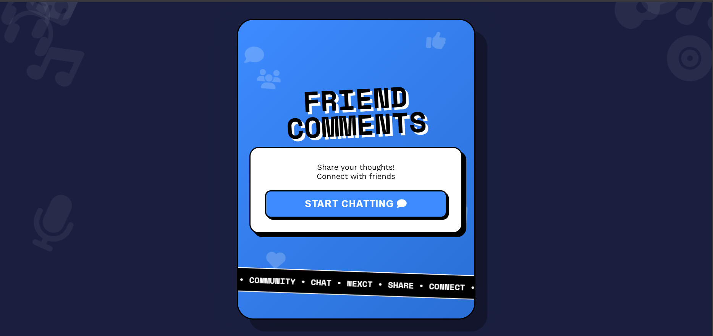
        </a>
        <p>
          <strong>NEXCT-Comments</strong> - Sebuah Web forum sederhana dengan fitur komentar yang tersimpan di database secara real-time.
        </p>
        <p>
          <a href="https://nexct-forum.vercel.app/">
            
          </a>
        </p>
      </div>
    </td>
    <td width="50%">
      <h3 align="center">NEXCT-SSWeb</h3>
      <div align="center">
        <a href="https://nexct-captureweb.vercel.app/" target="_blank">
          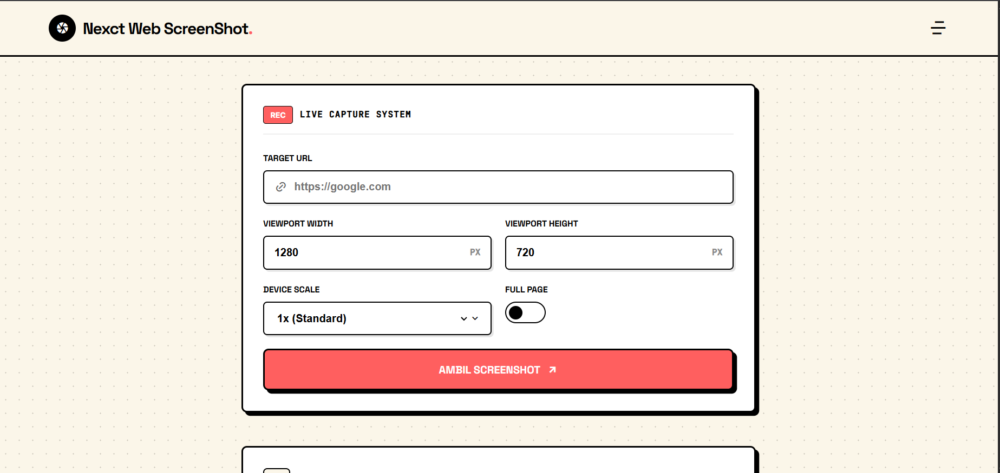
        </a>
        <p>
          <strong>NEXCT-SSWeb</strong> - Web Screenshot adalah tool berbasis web canggih untuk mengambil screenshot website secara real-time dengan kualitas tinggi.
        </p>
        <p>
          <a href="https://nexct-captureweb.vercel.app/">
            
          </a>
        </p>
      </div>
    </td>
</tr>
<tr>
    <td width="50%">
      <h3 align="center">NEXCT-YoutubeDL</h3>
      <div align="center">
        <a href="https://nexct-ytdl.vercel.app/" target="_blank">
          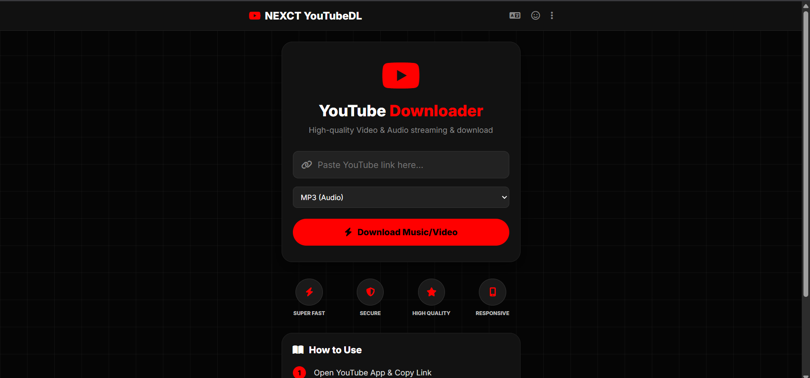
        </a>
        <p>
          <strong>NEXCT-YoutubeDL</strong> - Sebuah Web untuk Download video dan musik dari YouTube dengan MUDAH dan CEPAT!
        </p>
        <p>
          <a href="https://nexct-ytdl.vercel.app/">
            
          </a>
        </p>
      </div>
    </td>
    <td width="50%">
      <h3 align="center">NEXCT-Webclone</h3>
      <div align="center">
        <a href="https://nexctwebclone.vercel.app/" target="_blank">
          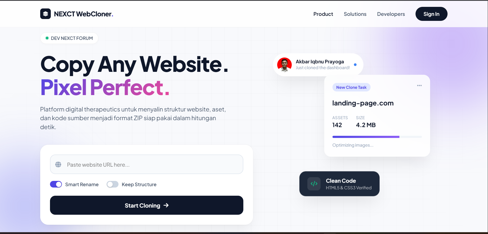
        </a>
        <p>
          <strong>NEXCT-Webclone</strong> - Web aplikasi clone dashboard/landing page yang dibuat sebagai latihan pengembangan frontend.
        </p>
        <p>
          <a href="https://nexctwebclone.vercel.app/">
            
          </a>
        </p>
      </div>
    </td>
</tr>
</table>

---

### Tools

<div align="center">


</div>

---

### 🌐 Quotes

    ```bash
    $ git log --grep="cinta"

    commit 8f2a3d1e5b7c9f0a2d4e6b8a0c2e4g6i8k0m2o4
    Author: aku <aku@email.com>
    Date:   Mon Feb 16 20:24:00 2026 +0700

        feat: menambahkan rasa sayang ke dalam hati

    commit 9g3b4e2f6c8d0a1b3e5f7g9h1i3j5l7n9p1r3t
    Author: dia <dia@email.com>
    Date:   Mon Feb 16 20:25:00 2026 +0700

        fix: menghapus harapan karena beda branch

    $ git merge dia
    error: branch 'dia' and 'aku' have divergent histories
    fatal: refusing to merge unrelated histories

    # Mungkin memang harus force push
    # Tapi takut kehilangan data

---

### 🌐 Connect With Me

<p align="center">
  <a href="https://nexct.vercel.app/">
    
  </a>
  <a href="https://github.com/AkbarIqbnuPrayoga">
    
  </a>
  <a href="https://www.instagram.com/akbariqbnu/">
    
  </a>
  <a href="https://www.tiktok.com/@4kb444r?">
    
  </a>
</p>

---

<div align="center">
  
  <p>© 2026 NEXCT B444R. Semua Hak Dilindungi. | Akbar Iqbnu Prayoga | Developer NEXCT</p>
</div>

---

<div align="center">


</div>